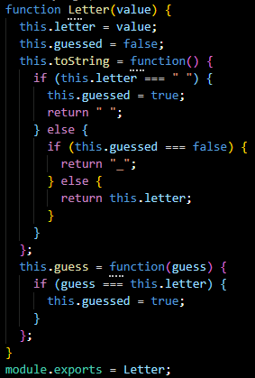
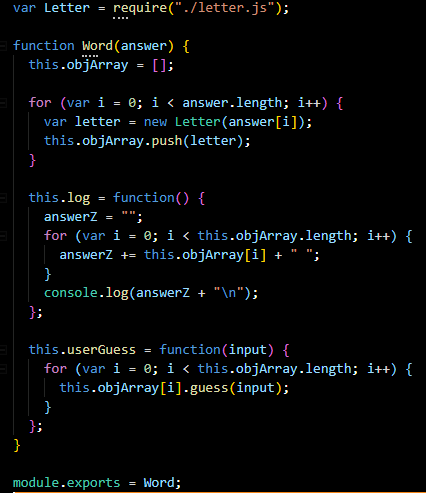
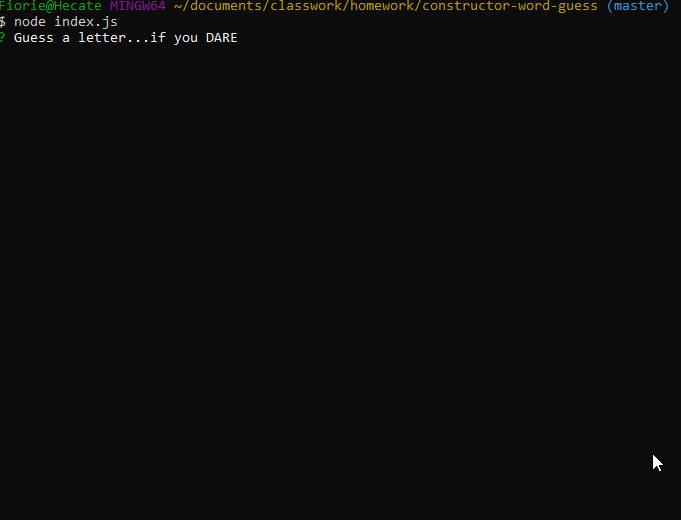

# Constructor-Word-Guess

A word guess game that is played completley in the command line!  
<i>Yeah, its kinda like hangman</i> 
This game uses constructors to operate, and is able to take user input using the inquirer npm.  

<h3>The letter.js file contains</h3><ul>

<li> a constructor that displays the placeholders for the word displayed.</li> 
<li>a string value to store the underlying character for the letter. </li>
<li> a boolean val to store if a letter has been guessed</li>
<li>function to return underling character if a letter was already guessed ORRRRR an underscore if it has not </li>
<li>function that takes a character as an arguement and checks it against the underlying character && updates the stored boolean (<i>if guessed correctly</i>)</ul> 

 

<h3>The word.js file contains </h3><ul>
<li> A CONSTRUCTOR!!!!!!!! surprised? -- this one has a word that is dependent on the letter constructor.  It creates an object representing the current word to be guessed.</li>
<li>an array of ~*new*~ letter objects that represent the letters of the underlying word.</li>
<li>a function that returns a string to rep. the word. -- it also calls the function in letter.js that displays the underscore and cocatenates them togeter. </li>
<li>a function that takes a character and calls the guess function on each letter</li></ul>
 
 
<h3>The index.js file contains</h3> <ul>
<li> code to randomly select a word and stores it in the word constructor</li>
<li> code that prompts user for each guess and tracks remaining guessed / letters guessed</li>
 

<h2>USES:</h2> 
- Chalk  
- Inquirer  
- Node.js  
- Javascript  
<h1>
Wanna see? </h1> 

